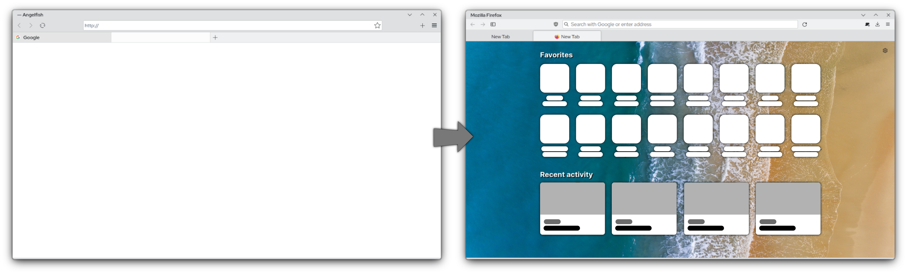

# Angelfox Theme for Firefox
 An Angelfish inspired CSS theme for Firefox, so it looks a bit more like Kirigami apps on KDE.

# TO DO
- Figure out how to match navbar background color to titlebar background color
- Get Breeze icons working
- Make the whole interface resemble Kirigami a bit more
